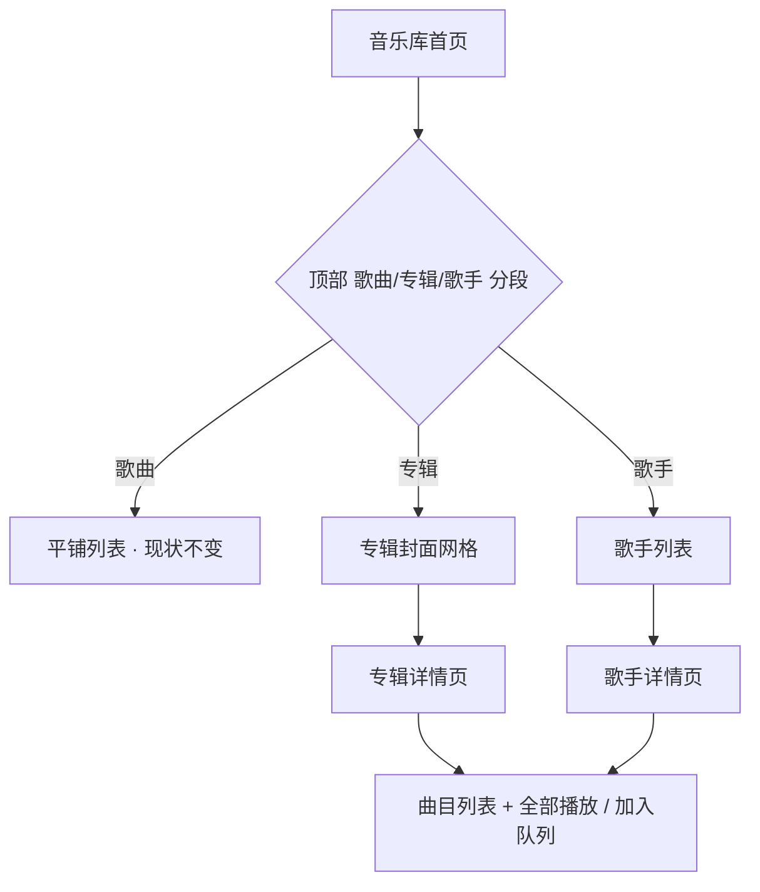

# 旋律 · MelodyPlayer 下一步规划（v2.19 起）

> 基线 **v2.18**（85 个 .kt / 约 21,200 行；352 条 JVM 单测全过；minSdk 26 / targetSdk 36；Media3 1.8.0）
> 本轮为**规划**，不含代码改动。逐条技术方案（接口签名 / 时序图 / 类图 / 任务表）见 [system_design.md](./system_design.md)。

---

## 一、现状诊断

功能面已经闭环：播放 / 曲库 / 歌单 / 歌词三来源 / 标签写回 / 封面 / KWM 解密都在。短板不在"能不能用"，而在三处：

1. **曲库只有一张平铺列表** —— 几千首之后只能靠搜索和排序，没有专辑/歌手维度，也没有"最近听"这类回访入口。
2. **几个"每天都想按一下"的开关缺位** —— 歌词对不齐没法调、睡前想定时关、想变速听。
3. **两个巨型文件拖慢后续每次改动** —— `PlayerViewModel.kt` 2738 行、`SettingsScreen.kt` 1835 行。

一句话：**该补的是"回访入口 + 每日微操作 + 结构解耦"，不是再加花活。**

---

## 二、需求池

### P0 —— 不做的代价最直接

| 编号 | 名称 | 类型 | 影响面 | 代价 |
|---|---|---|---|---|
| P0-1 | **歌词时间轴偏移校正**（整体提前/延后 0.5s，按曲记忆） | 新功能 | 播放页歌词区、`PlayerViewModel`、`Prefs` | 中→实测 **S** |
| P0-2 | **歌词副本全局入口 + 孤儿副本清理 + 修 README** | 优化/技术债 | `SettingsScreen`、`LyricCopySheet`、`LyricCopyGroups` | 小–中→**S** |
| P0-3 | **最近播放 / 常听 回访入口**（首页顶部横向卡片） | 新功能 | 曲库首页、新增 `PlayHistory`、`Prefs` | 中 → **M** |
| P0-4 | **设置页 IA 整改**（9 分区一段到底 → 分组二级页） | UI 设计/技术债 | `SettingsScreen`、`MelodyRoot`、README | 小–中 → **L** |

**关键背景**：P0-2 不是"从零加"，是把 v2.18 拆掉的那个全局清单**补一个入口回来**——现在曲库行 ⋮ / 播放页 ⋮ / 多选三处都只能看"这首歌"的副本，认不回歌曲的孤儿副本反而没了入口。同时 README 第 71 / 132 行仍写着"歌词副本在设置页管理"，已过时。

### P1 —— 明显提升，可等一版

| 编号 | 名称 | 类型 | 影响面 | 代价 |
|---|---|---|---|---|
| P1-1 | **睡眠定时器**（15/30/45/60/90 分钟，到点暂停） | 新功能 | `PlaybackService`、播放页 ⋮ | M |
| P1-2 | **专辑 / 歌手维度浏览**（封面网格 + 专辑页整张连播） | UI 设计/新功能 | `LibraryScreen`、新增 `AlbumScreen` | L |
| P1-3 | **拆分 `PlayerViewModel` / `SettingsScreen`**（纯重构、零行为变更） | 技术债 | 两个巨型文件 | M |
| P1-4 | **播放速度**（0.75×–1.5×，保音高） | 新功能 | 播放页 ⋮、Media3 `PlaybackParameters` | S |
| P1-5 | **搜索增强**（关键词高亮 + 最近搜索） | 优化 | `LibraryScreen`、`SongRow` | M |

> P1-5 有个更正：**字段扩展其实早就做完了** —— `SongQuery.filter` 已经在同时匹配 标题 / 歌手 / 专辑 / 文件名。真正剩下的是**高亮**与**最近搜索**。

### P2 —— 锦上添花 / 长线

| 编号 | 名称 | 结论 |
|---|---|---|
| P2-1 | 均衡器 | 技术可行，但机型差异大、易"炸音"，**不建议本版做** |
| P2-2 | 桌面小组件 | Compose 做 Widget 要引 Glance（破极简依赖），手写 RemoteViews 也不轻，**不建议做** |
| P2-3 | 播放次数统计 / 常听榜 | **与 P0-3 完全重叠**，已并入 P0-3（`playCount` 字段） |
| P2-4 | Android Auto | 需 Car App Library + 清单 + 车机验证，单人维护性价比低，**不建议做** |

---

## 三、建议的推进节奏

| 版本 | 内容 | 出包 |
|---|---|---|
| **v2.19** | P0-1 歌词偏移 + P1-4 播放速度 + P1-1 睡眠定时 + P0-2 副本全局入口 & 孤儿清理 | 可独立出包。前三项都只改播放页 ⋮ 弹层，天然一组 |
| **v2.20** | P0-3 最近播放 / 常听 | 可独立出包 |
| **v2.21** | P0-4 设置页 IA + P1-3 拆分两处巨型文件 | 可独立出包（纯重构 + IA，靠 352 单测守） |
| **v2.22** | P1-2 专辑/歌手浏览 + P1-5 搜索增强 | **必须一起出包**（同动库页顶部与列表） |

全流程**本地提交、不推 GitHub**；每版 `versionCode + 1`（41/2.18 → **42/2.19**）；UI 验证一律出 Release APK 交真机截图。

---

## 四、UI 设计稿

### UI-1 设置页整改（P0-4）

改前 —— 9 个分区一段到底，约 5 屏：

```
┌ 设置 ─────────────┐
│ 曲库              │
│ App 音乐库        │
│ 已隐藏的曲目      │
│ 播放              │
│ 外观              │
│ 歌词              │
│ 专辑封面          │
│ KWM音乐解密       │
│ 关于              │
│ ← 一路滚到底      │
└───────────────────┘
```

改后 —— 首屏只看分组，点进二级页：

```
┌ 设置 ──────────────────────────┐
│ [常用]                         │
│   播放模式 · 滑动切歌 · 睡眠定时 │  ← 常用项内联首屏, 避免多一次点击
│ ────────────────────────────── │
│ [曲库与文件]               ▸   │  ← 行高 56dp
│   曲库 / App音乐库 / 已隐藏 /   │
│   归档 / 歌词副本(全局入口)     │
│ ────────────────────────────── │
│ [播放]                     ▸   │
│ [外观与歌词]               ▸   │
│ [专辑封面]                 ▸   │
│ [KWM解密]      [关于]          │
└────────────────────────────────┘
```

### UI-2 歌词时间轴偏移校正（P0-1）

入口放**播放页歌词区顶部小条**，不放 ⋮ —— 偏移要边听边调，得一直在手边：

```
┌ 播放页 · 歌词视图 ────────────────┐
│  歌词偏移  −0.5s ▸ 未校正 ▸ +0.5s  │ ← 顶部小条, 点箭头步进 500ms
├──────────────────────────────────┤
│          (封面 / 歌名)            │
│        ▼ 当前行(高亮放大)         │
│          下一行                   │
│          再下一行                 │
│                                  │
│  ┈┈ 仅影响 App 内显示, 不改文件 ┈┈ │
└──────────────────────────────────┘
```

### UI-3 专辑 / 歌手维度浏览（P1-2）

```
┌ 音乐库 ──────────────────────────┐
│  [最近播放 ×6 横向卡片]  ← P0-3   │
│   歌曲   │   专辑   │   歌手      │ ← 顶部分段控件
├──────────────────────────────────┤
│ ┌──────┐  ┌──────┐               │
│ │ 封面 │  │ 封面 │   2 列网格     │
│ │专辑名│  │专辑名│   封面 120dp   │
│ │ 12首 │  │ 8首  │   圆角=封面形状│
│ └──────┘  └──────┘               │
└──────────────────────────────────┘
点专辑 → 专辑页 [大封面 + 曲目列表 + "全部播放 / 加入队列"]
```



---

## 五、明确不建议做的事

1. **接第三方统计 / 崩溃上报 SDK**（友盟、Firebase…）—— 直接破掉"无统计、无上报"的隐私底线，单人项目也没人看报表。
2. **账号体系 + 云同步 / 多端** —— 需要服务端、鉴权、冲突合并，与"无账号"约束正面冲突。
3. **用 Retrofit / OkHttp / Gson / Coil 替换自研 `SimpleHttp` / `MiniJson` / 手写 ImageVector** —— 现有能力已被三源歌词、iTunes 封面、KWM 完整验证过。
4. **在线曲库聚合 / 在线试听 / 跨平台下载** —— 版权法律风险，且违反"联网只在用户主动触发"的边界。（KWM 解密是本地已购文件，性质不同。）
5. **算法推荐歌单 / "猜你喜欢"** —— 没有云端数据与账号基础，做出来只能是假智能。

---

## 六、需要你拍板的问题

| # | 问题 | 选项 | 技术侧倾向 |
|---|---|---|---|
| Q1 | 曲库结构方向？ | A 保持单列表，只做搜索增强 · B 新增专辑/歌手维度浏览 · C 分两版推进（先搜索 → 再维度） | **B**（P1-2 与 P1-5 同版做最省） |
| Q2 | 歌词偏移保存口径？ | A 每首歌独立 · B 全局默认 + 单曲覆盖 · C 只在当前会话生效 | **A**（全局默认会让没调过的歌莫名偏移，归因困难） |
| Q3 | 睡眠定时器做到哪一层？ | A 只在 App 内倒计时（划掉即失效） · B 放播放服务保活，到点暂停并保留通知（可续播） · C 本版不做 | **B**（到点 `pause()` 而非停服务，保留队列可一键续播） |
| Q4 | 技术债拆分先动哪个？ | A 先拆 `PlayerViewModel` · B 先拆 `SettingsScreen` · C 本版不拆 | **B**（与 P0-4 设置页整改是同一次改动，不额外花成本） |
| Q5 | 新依赖底线？ | A 零新依赖（Widget 等一律手写或不做） · B 允许极个别纯 Kotlin 轻量库 · C 允许为高价值功能引成熟库 | **A**（本版全部可零新增依赖实现） |

**技术侧新发现的两个前置**：
- **没有导航库**（全程 `var tab` + `playerOpen` 手动切换）。任何二级页/专辑页都必须**状态驱动**，且返回键 `BackHandler` 注册顺序敏感 —— 必须先立一条"页面栈约定"，否则新页返回会误退 App。P0-4 与 P1-2 的共同前置。
- **`PlayerViewModel` 是 Activity 作用域**：App 被划掉后 VM 销毁而音乐仍在播。所以**睡眠定时的倒计时不能放 VM**，必须落 `PlaybackService`（播放历史计数可以容忍丢失，定时器不行）。

---

## 七、技术要点速览

- **P0-1 歌词偏移**：不改 `Lyrics` 模型、不重排时间轴 —— 高亮查询位置 = `positionMs - offsetMs`（正偏移 = 歌词延后）。偏移只进 `Prefs`，**写回文件标签的路径天然不带偏移，无需特判**。
- **P0-2 副本全局入口**：复用现成 `LyricCopiesSheet`，只加"看全部"开关（全局入口没有作用对象，用布尔比 `RequestKeys` 更诚实）+ 新增纯函数 `LyricCopyGroups.orphans()`；清理沿用"点两次确认"。
- **P0-3 播放历史**：一条记录两个字段 —— 「最近播放」播放即记，「常听」累计停留 ≥30s 才 +1（防快速划过污染）；存 key + 快照，只保留曲库仍在的。
- **P1-1 睡眠定时**：VM 只算 deadline 并展示，倒计时协程活在 `PlaybackService` 里（`sendCustomCommand`），到点 `pause()`。
- **P1-4 播放速度**：Media3 原生 `PlaybackParameters`，切歌自动保持；**倾向不持久化**（避免为播客调的速度静默套到所有歌）。
- **全版零新增第三方依赖**；新增图标一律手写 ImageVector；本批需求**全部纯本地，不触发任何网络**。
- 新增 8 个可单测的纯函数对象：`LyricOffset` / `PlayHistory` / `SleepTimer` / `Albums` / `Artists` / `PlaybackSpeed` / `TextHighlight` / `RecentSearches`（依赖"现在"的一律注入 `nowMs`，仿现有 `TimeFormat.ago`）。
