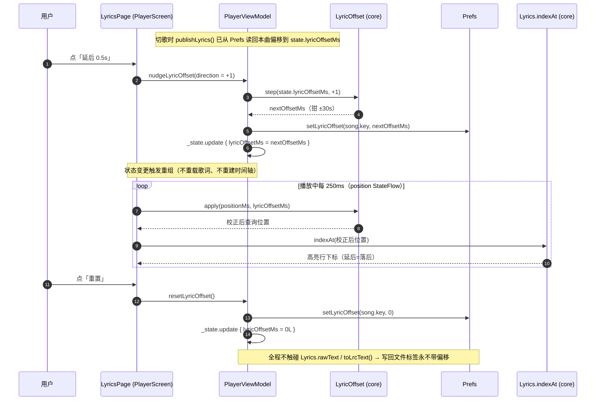
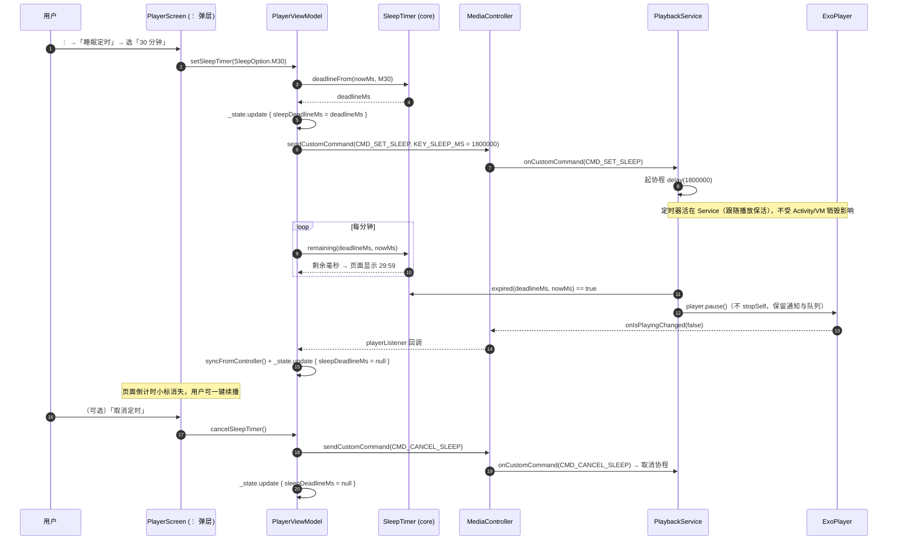
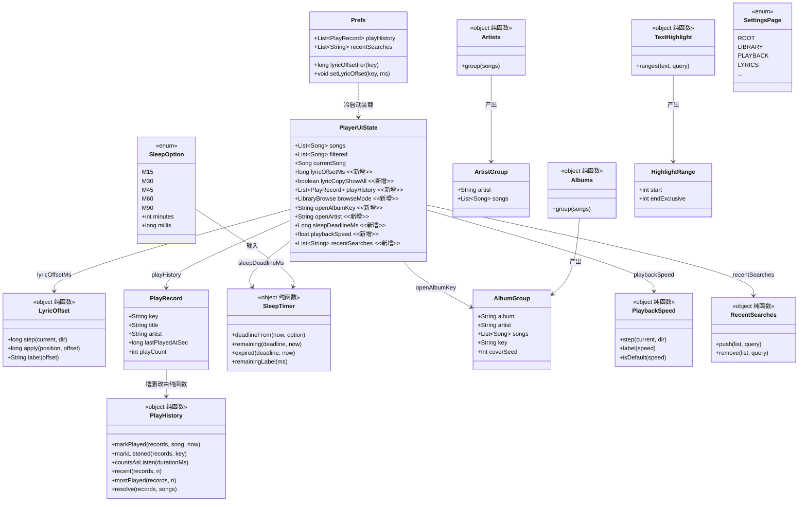

# MelodyPlayer 下一版需求池 — 可行性与工作量评估 + 任务分解

> 架构师高见远 · 基线 v2.18（85 个 .kt / ~21,200 行，352 条 JVM 单测，Gradle 8.9 + AGP 8.7.3，minSdk 26 / targetSdk 36，Media3 1.8.0）  
> 本文只做设计评估，不含业务代码。

## 一、总体技术判断

1. **可合并**：P0-1 歌词偏移 + P1-4 播放速度 + P1-1 睡眠定时 —— 三者都只往 `PlayerScreen` 的 ⋮ 动作弹层加一项、都往 `PlayerViewModel` + `PlayerUiState` 加字段，改同一处、天然一组，一起出包。
2. **P0-2 可搭车**：只加"看全部副本"入口 + 孤儿清理 + 改 README，几行逻辑。
3. **P0-3 单独排**：动曲库首页顶部 + 新增一套本地播放记录，和别的需求不重叠，独立出包。
4. **P0-4 与 P1-3 必须一起做**：设置页 IA 整改本身就是"把 `SettingsScreen`（1835 行）拆成根页 + 二级页"，拆文件就是实现手段；`PlayerViewModel`（2738 行）拆分机会性同行。
5. **P1-2 与 P1-5 一起做**：两者都重排 `LibraryScreen` 顶部与列表渲染，分开做顶部控件会打架。
6. **真正的前置**：**没有导航库**（全程 `var tab` + `playerOpen` 手动切换）—— 任何"二级页/专辑页"都必须状态驱动，且返回键 `BackHandler` 注册顺序敏感，必须先定这一层，否则新页返回会误退 App。P0-4 应为此先落一条"页面栈"约定。

---

## 二、逐条技术评估

### P0-1 歌词时间轴偏移校正

- **可行性结论**：**可直接做**。核心无需改动 `Lyrics` 模型与歌词加载链路，只在"高亮判定时把播放位置平移一下"即可，改动面极小。
- **实现方案要点**：
  1. 新增纯函数对象 `core/LyricOffset.kt`：约定"正偏移 = 歌词**延后**出现"，高亮查询位置 = `positionMs - offsetMs`。播放位置本身不变，只改送进 `Lyrics.indexAt()` 的参数 —— 因此**不动一帧时间轴数据、不触发重排**。
  2. `PlayerUiState` 加 `lyricOffsetMs: Long = 0L`；`PlayerViewModel` 加 `nudgeLyricOffset(direction)` / `resetLyricOffset()`，入口改状态即全页重组（"播放中即时生效"天然满足，无需重载歌词）。
  3. 每曲独立持久化：`data/Prefs.kt` 加**前缀键** `lyric_offset_<songKey>`（读默认 0，`-`/`+` 步进 500ms，钳到 ±30s），与既有 `lyric_uri_` / `lyric_name_` / `lyric_origin_` 同一套风格。切歌时在 `publishLyrics()` 里把该曲偏移读回状态。
  4. 入口挂在播放页**歌词视图顶部**的小条：「提前 0.5s / 未校正 / 延后 0.5s」+ 一个重置；不在 ⋮ 里（那里动作已多，偏移要边听边调，得一直在手边）。
  5. **绝不写回文件**：偏移只进 `Prefs` + 状态，不参与 `Lyrics.rawText` / `toLrcText()`，所以走 `TagEmbedder` / `LyricsTagWriter` 写标签的路径天然不带偏移 —— 无需任何特判。
- **涉及文件**：

| 相对路径                                                               | 动作                                              |
| ------------------------------------------------------------------ | ----------------------------------------------- |
| `app/src/main/java/com/melody/player/core/LyricOffset.kt`          | 新增（纯函数）                                         |
| `app/src/main/java/com/melody/player/data/Prefs.kt`                | 改（加 `lyricOffsetFor` / `setLyricOffset` + 前缀常量） |
| `app/src/main/java/com/melody/player/ui/player/PlayerUiState.kt`   | 改（加 `lyricOffsetMs`）                            |
| `app/src/main/java/com/melody/player/ui/player/PlayerViewModel.kt` | 改（`nudge/reset`、`publishLyrics` 读偏移）            |
| `app/src/main/java/com/melody/player/ui/screens/PlayerScreen.kt`   | 改（歌词页偏移小条 + 回调）                                 |
| `app/src/main/java/com/melody/player/ui/MelodyRoot.kt`             | 改（把两个回调接进 `PlayerScreen`）                       |
| `app/src/test/java/com/melody/player/LyricOffsetTest.kt`           | 新增                                              |

- **数据结构 / 接口签名**：

```kotlin
package com.melody.player.core

/**
 * 歌词时间轴偏移（用户手动校正）。
 * 正偏移 = 歌词整体**延后**出现；负 = **提前**。只影响 App 内的显示与高亮，
 * 绝不写回音频文件标签。
 */
object LyricOffset {
    const val STEP_MS = 500L
    const val MAX_MS = 30_000L          // ±30s，覆盖常见前奏/间奏差异

    /** 步进一挡并钳到上下限。 */
    fun step(currentMs: Long, direction: Int): Long =
        (currentMs + direction * STEP_MS).coerceIn(-MAX_MS, MAX_MS)

    /**
     * 高亮判定用的"校正后查询位置" = 播放位置 − 偏移。
     * 偏移为正（延后）时查更早的行 → 高亮落后 → 歌词看起来更晚出现。
     * 刻意**不**钳到 0：钳 0 会把开头几行塌到同一时刻，被 mergeEqualTimestamps 合并成一行。
     */
    fun apply(positionMs: Long, offsetMs: Long): Long = positionMs - offsetMs

    fun label(offsetMs: Long): String = when {
        offsetMs == 0L -> "未校正"
        offsetMs > 0L  -> "延后 ${offsetMs / 1000.0} 秒"
        else           -> "提前 ${-offsetMs / 1000.0} 秒"
    }
}
```

```kotlin
// Prefs.kt 追加
fun lyricOffsetFor(songKey: String): Long = sp.getLong(KEY_LYRIC_OFFSET_PREFIX + songKey, 0L)
fun setLyricOffset(songKey: String, offsetMs: Long) { /* 0 时 remove 键 */ }
private const val KEY_LYRIC_OFFSET_PREFIX = "lyric_offset_"
```

- **依赖包**：**零新增**。
- **工作量**：**S**（纯函数 + 一处状态 + 一个小条，约半天）。
- **风险与顺带技术债**：偏移对 `estimated`（自动对齐）歌词同样生效，语义上无意义但无害；不改 `Lyrics` 模型这点要守住，否则会牵出歌词缓存（`LyricsRepository` 的 `LruCache`）失效问题。
- **单测要点**：① `step` 在 ±MAX 处钳位、步进方向正确；② `apply` 为正/为负偏移的平移方向（延后时查询位置变小）；③ **平移后行数不变、不塌行**（≤0 时刻不合并）；④ `label` 三种文案；⑤ 写回路径不受影响 —— `Lyrics.toLrcText()` 输出与未设偏移时完全一致。

---

### P0-2 歌词副本集中管理（孤儿识别 + 一键清理）

- **可行性结论**：**可直接做**，且比 PM 预期更轻。**事实核查：v2.18 已把"设置页那份清单"整套拆掉**（`SettingsScreen` 现无歌词副本分区，只剩曲库行 ⋮ / 播放页 ⋮ / 多选三处的"按对象"弹层）。所以这条需求 = **补回一个"看全部（含未关联）"的全局入口 + 孤儿清理 + 修 README**，而不是改造现有入口。
- **实现方案要点**：
  1. 复用现成的 `LyricCopiesSheet` + `LyricCopyGroups.group()`；只加"看全部"判据。`PlayerUiState` 加 `lyricCopyShowAll: Boolean = false`；`MelodyRoot` 渲染弹层时：`showAll` 为真用全量 `state.lyricCopyGroups`，否则维持 `restrict(state.lyricCopyGroups, keys)`。**这与既有惯例不同处**：其余入口都传 `xxxRequestKeys`，全局入口没有"作用对象"，用一个布尔更诚实。
  2. 孤儿组天然沉底（`songKey == null` → `ORPHAN_TITLE`），新增纯函数 `LyricCopyGroups.orphans(groups)`；在弹层底部固定区加 `SheetFooterButton("清理未关联的副本", danger = true)`。
  3. 一键清理**沿用点两次确认惯例**：走根界面已有的 `pendingDeleteLyricShown` 同款 `AlertDialog`，文案说明"只删 App 内副本、不动音频文件、不动已写进文件的歌词"。
  4. 入口放设置页新分区「歌词副本」一行「查看全部副本（含未关联）→」，回调 `vm.requestLyricCopiesAll()`。
  5. **修 README**：第 71 行、第 132 行仍把"歌词副本"写成设置页分区（已过时），改为"曲库行 ⋮ / 播放页 ⋮ / 多选 / 设置页「查看全部」四个入口"。
- **涉及文件**：

| 相对路径                                                         | 动作                                            |
| ------------------------------------------------------------ | --------------------------------------------- |
| `.../core/LyricCopyGroups.kt`                                | 改（加 `orphans()`）                              |
| `.../ui/player/PlayerUiState.kt`                             | 改（加 `lyricCopyShowAll`）                       |
| `.../ui/player/PlayerViewModel.kt`                           | 改（加 `requestLyricCopiesAll()` / `dismiss` 复位） |
| `.../ui/components/LyricCopySheet.kt`                        | 改（底部固定区加"清理未关联"按钮，透传回调）                       |
| `.../ui/screens/SettingsScreen.kt`                           | 改（新分区「歌词副本」+ 一行入口）                            |
| `.../ui/MelodyRoot.kt`                                       | 改（全量/筛选判据 + 清理确认框）                            |
| `README.md`                                                  | 改（第 71、132 行）                                 |
| `app/src/test/java/com/melody/player/LyricCopyGroupsTest.kt` | 改（补 orphan 断言）                                |

- **数据结构 / 接口签名**：

```kotlin
object LyricCopyGroups {
    // ...已有 group / restrict...
    /** 认不回歌曲的副本组（songKey == null），全局视图里用于"一键清理"。 */
    fun orphans(groups: List<LyricCopyGroup>): List<LyricCopyGroup> =
        groups.filter { it.songKey == null }
}
```

- **依赖包**：**零新增**。
- **工作量**：**S**（半天，主要是文案与确认框接线）。
- **风险与顺带技术债**：不可撤销 → 必须两次确认（已纳入）；清理后若自动联网开着，孤儿副本不会自己回来（认不回歌），文案要说清。
- **单测要点**：① `orphans` 只挑 `songKey == null` 的组；② 空列表返回空；③ 含真实 key 的组不被误判为孤儿。

---

### P0-3 最近播放 / 常听 回访入口

- **可行性结论**：**可直接做**。纯本地计数 + 首页顶部一条横向卡片，零联网、零账号。
- **实现方案要点**：
  1. 新增 `data/` 侧的记录载体与 `core/PlayHistory.kt` 纯函数对象。记录一条 `PlayRecord(key, title, artist, lastPlayedAtSec, playCount)`，**存 key + 标题/歌手快照**（仿 `HiddenSongEntry`），原文件被删后还能如实标注。
  2. 持久化到 `data/Prefs.kt`：`var playHistory: List<PlayRecord>`，JSON 数组编解码（复用现成的 `JSONArray` 手写风格，与 `hiddenSongs` / `playlists` 一致），上限 200 条。
  3. **口径（推荐）**：一条记录两个字段 —— 「最近播放」在**播放即记**（更新 `lastPlayedAtSec` 并提到最前）；「常听」只在**累计停留 ≥ 30s** 才 `playCount + 1`。这样快速划过不会污染"最常听"，两个榜单语义都干净。计数实现：VM 在切歌时起一个 30s 协程（或按 position 增量累计），达标后 `markListened`。
  4. UI：`LibraryScreen` 顶部（`PlaylistChips` 之下、列表之上，且仅在**非搜索、非歌单视图**时）加一段 `LazyRow`，带「最近播放 / 最常听」小切换；卡片复用封面 + 歌名，点击 = 以该榜单为队列从这首开始播。新增 `ui/components/HistoryCards.kt`（垂直 `SongRow` 塞不进横向卡片）。
  5. 计数与写盘**只走 Prefs**，不引入任何"统计后台"。
- **涉及文件**：

| 相对路径                                                     | 动作                              |
| -------------------------------------------------------- | ------------------------------- |
| `.../core/PlayHistory.kt`                                | 新增（`PlayRecord` + 纯函数）          |
| `.../data/Prefs.kt`                                      | 改（`playHistory` 读写）             |
| `.../ui/player/PlayerUiState.kt`                         | 改（加 `playHistory`）              |
| `.../ui/player/PlayerViewModel.kt`                       | 改（`markPlayed` / 30s 计时 / 读回状态） |
| `.../ui/components/HistoryCards.kt`                      | 新增（横向卡片行）                       |
| `.../ui/screens/LibraryScreen.kt`                        | 改（顶部插入卡片段 + 回调）                 |
| `.../ui/MelodyRoot.kt`                                   | 改（接回调，点击→以榜单为队列播放）              |
| `app/src/test/java/com/melody/player/PlayHistoryTest.kt` | 新增                              |

- **数据结构 / 接口签名**：

```kotlin
package com.melody.player.core

data class PlayRecord(
    val key: String,
    val title: String,
    val artist: String?,
    val lastPlayedAtSec: Long,
    val playCount: Int
)

object PlayHistory {
    const val MAX_RECORDS = 200
    const val COUNT_THRESHOLD_MS = 30_000L

    /** 播放开始：更新时间、提到最前；次数不变。已存在则保留其 playCount。 */
    fun markPlayed(records: List<PlayRecord>, song: Song, nowSec: Long): List<PlayRecord>

    /** 停留达标：次数 +1。key 不存在时忽略。 */
    fun markListened(records: List<PlayRecord>, key: String): List<PlayRecord>

    /** 计入"常听"的时长门槛；未知时长(<=0)不因此被排除。 */
    fun countsAsListen(durationMs: Long): Boolean =
        durationMs <= 0L || durationMs >= COUNT_THRESHOLD_MS

    fun recent(records: List<PlayRecord>, n: Int): List<PlayRecord> =
        records.sortedByDescending { it.lastPlayedAtSec }.take(n)

    fun mostPlayed(records: List<PlayRecord>, n: Int): List<PlayRecord> =
        records.filter { it.playCount > 0 }
            .sortedWith(compareByDescending<PlayRecord> { it.playCount }
                .thenByDescending { it.lastPlayedAtSec })
            .take(n)

    /** 只保留曲库仍在的曲目，按记录顺序返回（供列表播放）。 */
    fun resolve(records: List<PlayRecord>, songs: List<Song>): List<Song>
}
```

- **依赖包**：**零新增**。
- **工作量**：**M**（半天到一天：计时器接进播放流转 + 首页横向卡片）。
- **风险与顺带技术债**：① 30s 计时器若放 `PlayerViewModel`（Activity 作用域），划掉 App 后丢失 —— 本需求可接受（计数非关键），但要在文案上不承诺"绝对精确"；② "最近播放"与"常听"对用户是同一条记录的两种排法，UI 上要一眼看出区别（切换标签 + 副标题写"播放 N 次"）；③ 卸载即失，需说明。
- **单测要点**：① `markPlayed` 去重、置顶、截断到 200；② `markListened` 只对已存在 key 生效、不新增记录；③ `recent`/`mostPlayed` 排序稳定（次数相同时按时间）；④ `resolve` 丢弃曲库已无的 key；⑤ `countsAsListen` 的 30s 边界与时长未知分支。

---

### P0-4 设置页信息架构整改（9 分区一段到底 → 分组二级页）

- **可行性结论**：**可直接做，但必须先落"页面栈约定"** —— 项目**没有导航库**，全程靠 `MelodyRoot` 里的 `var tab` + `playerOpen` 手动切换。加二级页要新增一层状态，并与现有 `BackHandler`（多选、播放页两条）排队，否则返回键会误退 App。
- **实现方案要点**：
  1. 引入一个纯枚举 `SettingsPage`（ROOT + 9 个二级页）作为页面标识；**页面栈放 `MelodyRoot`**（不是 `SettingsScreen`），与 `tab`/`playerOpen` 同级，这样返回键优先级可统一编排：`SettingsPage != ROOT` 的 `BackHandler` 要**注册在多选/播放页之后**（后者优先）。
  2. `SettingsContent` 改造成两段：根页 = 「常用」卡（**播放模式、滑动切歌、睡眠定时**三个 PM 指定留首屏的项）+ 分组入口列表（每行标题 + 一句摘要，点进二级页）；二级页 = 现有 9 个 `SectionCard` 的内容原样搬进去。
  3. **顺带拆分 `SettingsScreen.kt`（1835 行）**：根页 → `ui/screens/SettingsRootScreen.kt`；每个分区 → `ui/screens/settings/SettingsXxxPage.kt`；保留 `SettingsTopBar`（二级页顶栏显示返回箭头 + 页名）。
  4. 二级页可深链：`SettingsPage` 枚举天然给"从别处跳到某设置页"留了口子（如歌词来源问题提示可直达 `LYRICS`）。
  5. 同步更新 README 第 130–132 行的设置页说明。
- **涉及文件**：

| 相对路径                                                   | 动作                                           |
| ------------------------------------------------------ | -------------------------------------------- |
| `.../ui/screens/SettingsRootScreen.kt`                 | 新增（根页 + 分组入口）                                |
| `.../ui/screens/settings/SettingsLibraryPage.kt` 等 9 个 | 新增（原分区内容搬迁）                                  |
| `.../ui/screens/SettingsScreen.kt`                     | 改（改为页容器 + `SettingsTopBar`，大量抽出）             |
| `.../ui/MelodyRoot.kt`                                 | 改（`settingsPage` 状态 + `BackHandler` 编排 + 透传） |
| `README.md`                                            | 改（第 130–132 行）                               |

- **数据结构 / 接口签名**：

```kotlin
// ui/screens/SettingsScreen.kt（顶层，供 MelodyRoot 与二级页共用）
enum class SettingsPage(val title: String, val isRoot: Boolean = false) {
    ROOT("设置", isRoot = true),
    LIBRARY("曲库"), ARCHIVE("App 音乐库"), HIDDEN("已隐藏的曲目"),
    PLAYBACK("播放"), APPEARANCE("外观"), LYRICS("歌词"),
    COVER("专辑封面"), KWM("KWM音乐解密"), ABOUT("关于")
}

@Composable
fun SettingsContent(
    state: PlayerUiState,
    page: SettingsPage,
    onNavigate: (SettingsPage) -> Unit,
    onBack: () -> Unit,
    /* ...现有的一堆回调原样保留... */
)
```


- **依赖包**：**零新增**（关键：**不引 Navigation-Compose**；用状态驱动即可，与项目既有"手写导航"一脉相承）。
- **工作量**：**L**（1.5–2 天：拆 1835 行 + 逐页搬迁 + 回归验证；纯搬运，无新逻辑）。
- **风险与顺带技术债**：① 搬迁期行为漂移 → 靠现有 352 单测 + 手动逐页核对；② 返回键优先级是新引入的坑，务必在根层统一；③ 二级页让常用项多一次点击 → 用"常用卡"把高频项留在首屏，可接受。
- **单测要点**：设置页自身是 UI，单测主要覆盖**从它抽出的纯函数**（若有新的排序/摘要生成）；核心是**回归**：拆分前后 `SettingsContent` 的可见分区集合一致（可用一个 `SettingsPage.entries.filterNot{isRoot}` 与 README 列表的一致性断言兜住）。

---

### P1-1 睡眠定时器

- **可行性结论**：**需先解决一个前置：倒计时不能只放 `PlayerViewModel`**。VM 是 Activity 作用域，App 被划掉后 VM 即销毁，而音乐仍在播 —— 正是用户要避免的"通宵耗电"。**推荐把倒计时的执行放进 `PlaybackService`**（它跟着播放存活）。
- **实现方案要点**：
  1. VM 侧只做"展示与发起"：`PlayerUiState` 加 `sleepDeadlineMs: Long?`；`setSleepTimer(option)` 算出 deadline → 更新状态（驱动 UI 倒计时显示）→ 通过 `MediaController.sendCustomCommand` 发一条自定义命令把毫秒数交给 service。
  2. `PlaybackService` 在 `MediaSession.Callback.onCustomCommand` 里接 `SET_SLEEP`：起一个协程 `delay(ms)` 后 `player.pause()`；`CANCEL_SLEEP` 取消协程。**到点用"暂停"而不是"停服务"**：保留通知、队列与位置，用户睁眼还能一键续播；且 `pause()` 后服务仍在前台一段时间，不会丢状态。
  3. 倒计时**不落盘**：App 重开后定时器自然失效（符合"临时设一下"的直觉，避免"重开 App 5 分钟后莫名暂停"）。
  4. 入口：播放页 ⋮ → 「睡眠定时」→ `MelodyActionSheet` 列出 15/30/45/60/90 分钟 + 「取消定时」；已设时页面上留一个 `1:29:00` 倒计时小标。
  5. 需要一个手写图标（月亮/定时器）加进 `MelodyIcons.kt`。
- **涉及文件**：

| 相对路径                                                    | 动作                                   |
| ------------------------------------------------------- | ------------------------------------ |
| `.../core/SleepTimer.kt`                                | 新增（枚举 + 纯函数）                         |
| `.../playback/PlaybackService.kt`                       | 改（`onCustomCommand` + 倒计时协程）         |
| `.../ui/player/PlayerUiState.kt`                        | 改（加 `sleepDeadlineMs`）               |
| `.../ui/player/PlayerViewModel.kt`                      | 改（`setSleepTimer` / `cancel` / 发送命令） |
| `.../ui/screens/PlayerScreen.kt`                        | 改（⋮ 加「睡眠定时」+ 倒计时小标）                  |
| `.../ui/icons/MelodyIcons.kt`                           | 改（加 `Moon` 或 `Timer` 手写矢量）           |
| `app/src/test/java/com/melody/player/SleepTimerTest.kt` | 新增                                   |

- **数据结构 / 接口签名**：

```kotlin
package com.melody.player.core

enum class SleepOption(val minutes: Int, val label: String) {
    M15(15, "15 分钟"), M30(30, "30 分钟"), M45(45, "45 分钟"),
    M60(60, "1 小时"), M90(90, "1.5 小时");
    val millis: Long get() = minutes * 60_000L
}

object SleepTimer {
    fun deadlineFrom(nowMs: Long, option: SleepOption): Long = nowMs + option.millis
    fun remaining(deadlineMs: Long, nowMs: Long): Long = (deadlineMs - nowMs).coerceAtLeast(0L)
    fun expired(deadlineMs: Long, nowMs: Long): Boolean = nowMs >= deadlineMs
    /** "29:59"；不足 1 分钟给"不到 1 分钟"。 */
    fun remainingLabel(remainingMs: Long): String
}
```

```kotlin
// PlaybackService.companion
const val CMD_SET_SLEEP = "com.melody.player.SET_SLEEP"
const val CMD_CANCEL_SLEEP = "com.melody.player.CANCEL_SLEEP"
const val KEY_SLEEP_MS = "sleep_ms"
```

- **依赖包**：**零新增**（`MediaSession.sendCustomCommand` 是 Media3 自带能力）。
- **工作量**：**M**（一天：service 侧命令 + 协程 + 状态同步）。
- **风险与顺带技术债**：① 跨进程保活已由 `MediaSessionService`（前台播放）兜住，无需额外 WorkManager/前台服务；② VM 的显示倒计时与 service 的真实 deadline 要**单点对齐**（都以 VM 算出的 deadline 为准），否则显示与到点不一致；③ 若用户在到点前手动暂停，定时器要不要留？推荐**保留**（暂停≠取消），到点无事发生即可。
- **单测要点**：① `deadlineFrom` 精确到毫秒；② `remaining` 不为负；③ `expired` 的边界（等于 deadline 即过期）；④ `remainingLabel` 跨小时/不足 1 分钟两种文案。

---

### P1-2 专辑 / 歌手维度浏览（封面网格 + 专辑页）

- **可行性结论**：**可直接做，但聚合键只有 `artist` 可用**。**事实核查：`core/Song.kt` 没有 `albumArtist` 字段** —— 要支持"专辑艺术家"得回到 `core/tags` 解析更多标签帧，成本不划算。推荐用 `(album, artist)` 聚合。
- **实现方案要点**：
  1. 新增 `core/AlbumGrouping.kt`：`AlbumGroup(album, artist, songs)` 与 `ArtistGroup(artist, songs)`，全部纯函数，`"<unknown>"` 归一为"未知专辑/未知歌手"（与 `Song.albumOrUnknown` 一致）。
  2. `LibraryScreen` 视图形加一个"歌曲 / 专辑 / 歌手"分段控件（复用播放页那个视图切换的样式，别新造）。分段态用 `PlayerUiState.browseMode`（枚举 `SONGS/ALBUMS/ARTISTS`）。
  3. 专辑视图 = 封面网格（`LazyVerticalGrid`），点进**专辑页**（`ui/screens/AlbumScreen.kt`）显示头部 + 曲目列表（复用 `SongRow`）+「整张连播」。无内嵌封面 → 复用现成的 `Song.artworkSeed` 程序化占位图，**不需要占位图资源**。
  4. 专辑页/歌手页在库页内部**内容替换**（像现在的歌单视图那样），不是全屏浮层；选中对象的 key 用 `PlayerUiState.openAlbumKey / openArtist` 承载（可跨重组），返回用 `BackHandler`（并入 P0-4 的页面栈）。
  5. 与 P1-5 同版：分段控件与搜索框、最近播放卡片都在库页顶部，必须一起排布。
- **涉及文件**：

| 相对路径                                                       | 动作                                              |
| ---------------------------------------------------------- | ----------------------------------------------- |
| `.../core/AlbumGrouping.kt`                                | 新增（`AlbumGroup` / `ArtistGroup` + 纯函数）          |
| `.../ui/player/PlayerUiState.kt`                           | 改（`browseMode` / `openAlbumKey` / `openArtist`） |
| `.../ui/player/PlayerViewModel.kt`                         | 改（切分段 / 进专辑 / 返回 / 连播）                          |
| `.../ui/screens/LibraryScreen.kt`                          | 改（分段控件 + 网格 + 专辑/歌手视图分支）                        |
| `.../ui/screens/AlbumScreen.kt`                            | 新增（专辑头 + 曲目列表 + 连播）                             |
| `.../ui/components/CoverGridCell.kt`                       | 新增（网格单元）                                        |
| `.../ui/MelodyRoot.kt`                                     | 改（接回调 + 返回键）                                    |
| `app/src/test/java/com/melody/player/AlbumGroupingTest.kt` | 新增                                              |

- **数据结构 / 接口签名**：

```kotlin
package com.melody.player.core

data class AlbumGroup(val album: String, val artist: String, val songs: List<Song>) {
    /** 聚合键：专缉 + 艺人，避免不同歌手的同名专辑被并成一张。 */
    val key: String get() = "$album\u0000$artist"
    val count: Int get() = songs.size
    val durationMs: Long get() = songs.sumOf { it.durationMs }
    val coverSeed: Int get() = songs.first().artworkSeed
}

data class ArtistGroup(val artist: String, val songs: List<Song>) {
    val key: String get() = artist
    val count: Int get() = songs.size
}

object Albums {
    /** 未命名专辑/未知歌手归入 "未知专辑"/"未知歌手"（与 Song.albumOrUnknown 一致）。 */
    fun group(songs: List<Song>): List<AlbumGroup>
}
object Artists {
    fun group(songs: List<Song>): List<ArtistGroup>
}
```

- **依赖包**：**零新增**（网格用 `androidx.compose.foundation.lazy.grid`，已在 foundation 内）。
- **工作量**：**L**（1.5–2 天：网格 + 专辑页 + 两套聚合 + 与搜索/最近播放的排布）。
- **风险与顺带技术债**：① 聚合键用 `artist` 在合辑场景不完美（同一张合辑不同艺人会被拆）—— 记为已知降级；② 专辑页要能整张连播（`playAll(group.songs, 0)`），别退化成单曲播放；③ 与 P0-3 的顶部卡片、P1-5 的搜索框共用顶部区域，排版需定稿。
- **单测要点**：① `group` 按 `(album, artist)` 正确归并、未知值归一；② 空列表返回空；③ 各专辑内曲目顺序稳定（按标题或原序，需固定）；④ `ArtistGroup` 按歌手归并、计数正确。

---

### P1-3 拆分 `PlayerViewModel` / `SettingsScreen` 巨型文件

- **可行性结论**：**可直接做**，&#x4F46;**`SettingsScreen` 的拆分与 P0-4 是同一次改动**（IA 整改的实现手段），不应单列。`PlayerViewModel` 拆分有机会性，建议同版。
- **实现方案要点**：
  1. **`SettingsScreen`**：见 P0-4，拆成根页 + 9 个二级页文件。
  2. **`PlayerViewModel`（2738 行）**：按"协作者类"外提，而不是简单挪文件。私有字段不能跨文件访问，纯 extension 函数拿不到 `private` 状态，所以要按管线整块搬：
     - 封面管线（`backfillCovers` / `fetchCoverInternal` / `coverJobs` / 取消标志）→ `ui/player/CoverCoordinator.kt`；
     - 归档管线（`archiveAll` / 取消 / 进度）→ `ui/player/ArchiveCoordinator.kt`；
     - 歌词管线（`loadLyrics` / `publishLyrics` / 候选）→ 可保留在 VM 或提 `LyricsCoordinator.kt`，与 P0-1 一起动时顺带提。
     - 每个协作者**通过构造函数拿到它需要的依赖与回调**（不反向持有整只 VM）。
  3. **零行为变更**：靠现有 352 单测守住；每提一块就全绿再提下一块。
  4. 顺序建议：先 `SettingsScreen`（与 P0-4 绑定），再 `PlayerViewModel` 的封面/归档两块（最大、最独立）。
- **涉及文件**：

| 相对路径                                                | 动作           |
| --------------------------------------------------- | ------------ |
| `.../ui/player/PlayerViewModel.kt`                  | 改（外提协作者，瘦身）  |
| `.../ui/player/CoverCoordinator.kt`                 | 新增           |
| `.../ui/player/ArchiveCoordinator.kt`               | 新增           |
| `.../ui/screens/SettingsScreen.kt`（及 settings/ 子文件） | 改/新增（同 P0-4） |

- **数据结构 / 接口签名**：以协作者类为主，示例：

```kotlin
// ui/player/CoverCoordinator.kt
internal class CoverCoordinator(
    private val covers: AlbumArt,
    private val songs: () -> List<Song>,
    private val onProgress: (CoverProgress) -> Unit,
    private val onMessage: (String) -> Unit,
    private val scope: CoroutineScope
) {
    fun backfill(force: Boolean) { /* ... */ }
    fun cancel() { /* ... */ }
    fun fetchFor(song: Song, force: Boolean) { /* ... */ }
}
```

- **依赖包**：**零新增**。
- **工作量**：**M**（`PlayerViewModel` 两块管线约 1 天；`SettingsScreen` 计入 P0-4）。
- **风险与顺带技术债**：重构期行为漂移是唯一真风险 —— 严格"每步全绿"；不要顺手改逻辑（发现的问题记 TODO，另开任务）。
- **单测要点**：不新增业务断言；以**现有 352 条继续全过**为准。若外提出新的纯函数，才补对应单测。

---

### P1-4 播放速度（变速 0.75×–1.5×）

- **可行性结论**：**可直接做**，Media3 原生支持，且**切歌后自动保持**（`PlaybackParameters` 是播放器级而非媒体项级）。
- **实现方案要点**：
  1. 新增 `core/PlaybackSpeed.kt` 纯函数；`PlayerUiState` 加 `playbackSpeed: Float = 1f`。
  2. VM：`setPlaybackSpeed(speed)` → `withController { it.setPlaybackParameters(PlaybackParameters(speed)) }` + 更新状态。**音高保持**由 Media3 默认行为提供，无需额外处理。
  3. **持久化策略（推荐不持久化）**：仅本会话有效。理由：为某首播客调快的速度不该在下次冷启动时静默套到所有音乐上；且 service 存活期间跨曲自动保持，已满足"切歌不变"。
  4. 入口：播放页 ⋮ →「播放速度」→ `MelodyActionSheet` 列出预设（0.75 / 0.9 / 1.0 / 1.1 / 1.25 / 1.5）；非 1.0 时页面留一个 `1.25×` 小标。
- **涉及文件**：

| 相对路径                                                       | 动作                    |
| ---------------------------------------------------------- | --------------------- |
| `.../core/PlaybackSpeed.kt`                                | 新增（纯函数）               |
| `.../ui/player/PlayerUiState.kt`                           | 改（加 `playbackSpeed`）  |
| `.../ui/player/PlayerViewModel.kt`                         | 改（`setPlaybackSpeed`） |
| `.../ui/screens/PlayerScreen.kt`                           | 改（⋮ 加「播放速度」+ 小标）      |
| `app/src/test/java/com/melody/player/PlaybackSpeedTest.kt` | 新增                    |

- **数据结构 / 接口签名**：

```kotlin
package com.melody.player.core

object PlaybackSpeed {
    const val MIN = 0.75f
    const val MAX = 1.5f
    const val STEP = 0.05f
    val PRESETS = listOf(0.75f, 0.9f, 1.0f, 1.1f, 1.25f, 1.5f)

    /** 步进并钳位；跨过 1.0 时吸附到正好 1.0，避免出现 0.95×/1.00× 的糊弄挡。 */
    fun step(current: Float, direction: Int): Float

    fun label(speed: Float): String = "%.2f×".format(speed)
    fun isDefault(speed: Float): Boolean = kotlin.math.abs(speed - 1f) < 0.001f
}
```

- **依赖包**：**零新增**。
- **工作量**：**S**（半天）。
- **风险与顺带技术债**：① 若将来要持久化，注意 media3 恢复时需重新 `setPlaybackParameters`；② 变速下 `position` 与真实墙钟时间比例变化，对 P1-1 睡眠定时无影响（定时器按墙钟算）。
- **单测要点**：① `step` 上下限钳位；② 吸附 1.0（0.95→1.0 / 1.05→1.0）；③ `label` 两位小数；④ `isDefault` 容差。

---

### P1-5 曲库搜索增强（字段扩展 + 关键词高亮 + 最近搜索）

- **可行性结论**：**建议降级为简化版** —— **字段扩展其实已完成**：`SongQuery.filter` 早已同时匹配 `title / artist / album / displayName`。这条真正剩下的是**关键词高亮 + 最近搜索**。
- **实现方案要点**：
  1. 新增 `core/TextHighlight.kt` 纯函数：返回命中区间列表（大小写不敏感、多处命中），Compose 侧用 `AnnotatedString + SpanStyle` 渲染。`SongRow` 的标题/歌手/专辑按 `state.query` 高亮。
  2. 新增 `core/RecentSearches.kt` + `Prefs.recentSearches: List<String>`（复用 `encodeArray/decodeArray`）：最近 8 条、去重、最新在前。搜索框聚焦且为空时在下方列 chips，点一条即填入。
  3. **不引拼音库、不做首字母搜索**（硬约束），本版不做轻量映射。
  4. 与 P1-2 同版（同动 `LibraryScreen` 顶部与列表渲染）。
- **涉及文件**：

| 相对路径                                                        | 动作                     |
| ----------------------------------------------------------- | ---------------------- |
| `.../core/TextHighlight.kt`                                 | 新增（纯函数）                |
| `.../core/RecentSearches.kt`                                | 新增（纯函数）                |
| `.../data/Prefs.kt`                                         | 改（`recentSearches` 读写） |
| `.../ui/player/PlayerUiState.kt`                            | 改（加 `recentSearches`）  |
| `.../ui/player/PlayerViewModel.kt`                          | 改（push / clear）        |
| `.../ui/screens/LibraryScreen.kt`                           | 改（最近搜索 chips）          |
| `.../ui/components/SongRow.kt`                              | 改（标题/歌手/专辑高亮）          |
| `app/src/test/java/com/melody/player/TextHighlightTest.kt`  | 新增                     |
| `app/src/test/java/com/melody/player/RecentSearchesTest.kt` | 新增                     |

- **数据结构 / 接口签名**：

```kotlin
package com.melody.player.core

data class HighlightRange(val start: Int, val endExclusive: Int)

object TextHighlight {
    /** 大小写不敏感、全匹配；空 query 返回空列表。命中区间不重叠、按出现顺序。 */
    fun ranges(text: String, query: String): List<HighlightRange>
}

object RecentSearches {
    const val MAX = 8
    /** 去空白、去重（最新在前）、截断到 MAX。空白查询不写入。 */
    fun push(list: List<String>, query: String): List<String>
    fun remove(list: List<String>, query: String): List<String>
}
```


- **依赖包**：**零新增**（明确**不引拼音库**）。
- **工作量**：**M**（一天：高亮渲染 + 最近搜索 chips）。
- **风险与顺带技术债**：① 高亮对中文子串与大小写英文都要正确；② 空查询/纯空格不能触发高亮或写历史；③ 搜索结果的"找到 N 首"文案与空态要跟着改。
- **单测要点**：① `ranges` 多处命中、大小写不敏感、空查询返回空、中文命中；② `push` 去重置顶、超 8 截断、空白不写；③ `remove` 不存在的项为无操作。

---

## 三、时序图

### 图 1：P0-1 歌词偏移（改偏移 → 立刻重算高亮 → 持久化 → 播放中即时生效）



### 图 2：P1-1 睡眠定时器（设定 → 倒计时 → 到点暂停）



---

## 四、数据模型（类图）



---

## 五、任务分解与实现顺序

### 有序任务表

| 序号  | 任务                                        | 依赖                          | 涉及文件（要点）                                                                                                                            | 估量 | 建议版本  |
| --- | ----------------------------------------- | --------------------------- | ----------------------------------------------------------------------------------------------------------------------------------- | -- | ----- |
| T01 | P0-1 歌词偏移校正                               | —                           | `core/LyricOffset.kt`(新)、`Prefs`、`PlayerUiState`、`PlayerViewModel`、`PlayerScreen`                                                   | S  | v2.19 |
| T02 | P1-4 播放速度                                 | —                           | `core/PlaybackSpeed.kt`(新)、`PlayerUiState`、`PlayerViewModel`、`PlayerScreen`                                                         | S  | v2.19 |
| T03 | P1-1 睡眠定时器                                | T02（同一 ⋮ 弹层，建议后于 T01/T02 合) | `core/SleepTimer.kt`(新)、`PlaybackService`、`PlayerUiState`、`PlayerViewModel`、`PlayerScreen`、`MelodyIcons`                            | M  | v2.19 |
| T04 | P0-2 歌词副本全局入口 + 孤儿清理 + README             | —                           | `LyricCopyGroups`、`PlayerUiState`、`PlayerViewModel`、`LyricCopySheet`、`SettingsScreen`、`MelodyRoot`、`README`                         | S  | v2.19 |
| T05 | P0-3 最近播放 / 常听                            | —                           | `core/PlayHistory.kt`(新)、`Prefs`、`PlayerUiState`、`PlayerViewModel`、`HistoryCards.kt`(新)、`LibraryScreen`、`MelodyRoot`                | M  | v2.20 |
| T06 | P0-4 设置页 IA 二级页 + P1-3a SettingsScreen 拆分 | —                           | `SettingsRootScreen.kt`(新)、`settings/*.kt`(新)、`SettingsScreen`、`MelodyRoot`、`README`                                                | L  | v2.21 |
| T07 | P1-3b PlayerViewModel 拆分（封面/归档管线外提）       | 建议在 T06 后（同名文件区不相干，可并行）     | `PlayerViewModel`、`CoverCoordinator.kt`(新)、`ArchiveCoordinator.kt`(新)                                                               | M  | v2.21 |
| T08 | P1-2 专辑 / 歌手浏览                            | 与 T09 同版                    | `core/AlbumGrouping.kt`(新)、`PlayerUiState`、`PlayerViewModel`、`LibraryScreen`、`AlbumScreen.kt`(新)、`CoverGridCell.kt`(新)、`MelodyRoot` | L  | v2.22 |
| T09 | P1-5 搜索高亮 + 最近搜索                          | 与 T08 同版                    | `core/TextHighlight.kt`(新)、`core/RecentSearches.kt`(新)、`Prefs`、`PlayerUiState`、`PlayerViewModel`、`LibraryScreen`、`SongRow`          | M  | v2.22 |

> 说明：T01/T02/T03 三者都往播放页 ⋮ 弹层加项、都改 `PlayerUiState`/`PlayerViewModel`，**代码层面天然一组**，合并成一个工程交付（v2.19）可省一轮真机验证；但每条也能独立出包验证。T08/T09 都重排库页顶部与列表渲染，**必须同版**，否则顶部控件布局互相打架。

### 版本切分建议

| 版本        | 内容                                                                 | 出包验证方式                                                                                  |
| --------- | ------------------------------------------------------------------ | --------------------------------------------------------------------------------------- |
| **v2.19** | T01 + T02 + T03 + T04（歌词偏移 / 播放速度 / 睡眠定时 / 歌词副本全局入口&孤儿清理 + README） | **可以独立出包验证**。前三项共改播放页 ⋮，建议一块出包；T04 独立但可搭车。真机截图重点：播放页 ⋮ 弹层布局、歌词页偏移小条、倒计时小标、设置页"看全部副本"入口。 |
| **v2.20** | T05（最近播放 / 常听）                                                     | **可以独立出包验证**。真机截图重点：库页顶部横向卡片 + 榜单切换。                                                    |
| **v2.21** | T06 + T07（设置页 IA 二级页 + SettingsScreen/PlayerViewModel 拆分）          | **可以独立出包验证**。纯重构 + IA，重点回归：352 单测全绿 + 逐页截图核对（拆分前后分区一致）。                                 |
| **v2.22** | T08 + T09（专辑/歌手浏览 + 搜索高亮&最近搜索）                                     | **必须一起出包**（同动库页顶部与列表）。真机截图重点：分段控件、封面网格、专辑页、搜索高亮、最近搜索 chips。                             |

- 全流程**本地提交、不推 GitHub**；每版 `versionCode + 1`、`versionName` 顺延（当前 41 / 2.18 → 下一版 42 / 2.19）。
- **UI 验证方式**：不用模拟器，出 Release APK 交真机安装、截图反馈。

### 共享知识 / 跨文件约定

- **状态字段命名**：跨层"请求"沿用 `xxxRequestKeys: Set<String>?`（如新增的副本全局可另用 `lyricCopyShowAll: Boolean`）；一次性展示用 `xxx: T?`；纯布尔开关用 `xxxEnabled` / `showXxx`。
- **纯函数约定**：判算逻辑一律抽成**顶层 `internal`（`ui/screens/`）或 `core/`** 的 object；依赖"现在"的函数必须**注入 `nowMs`**（仿 `TimeFormat.ago(epochSec, nowSec)`），否则边界钉不住。本次新增 8 个纯函数对象：`LyricOffset` / `PlayHistory` / `SleepTimer` / `Albums` / `Artists` / `PlaybackSpeed` / `TextHighlight` / `RecentSearches`。
- **弹层参数顺序**：`MelodyListSheet` 的 `content` **必须保持最后一个参数**（尾随 lambda 绑定）；新弹层一律复用 `MelodyActionSheet` / `MelodyInfoSheet` / `MelodyListSheet` 三件套，**不新造风格**。
- **弹层挂根界面**：任何跨页弹层（歌词偏移对话、睡眠选项、副本全局、清理确认）一律挂 `ui/MelodyRoot.kt` 根 Box，否则会被全屏播放页浮层盖住。
- **返回键编排**：新增二级页/专辑页的 `BackHandler` 一律在 `MelodyRoot` 统一注册，**后注册优先**；顺序为「多选 → 播放页 → 二级页/专辑页」。
- **不改文件原则**：歌词偏移、播放历史、睡眠定时、播放速度**一律只写 Prefs/内存**，绝不进入 `LyricsTagWriter` / `TagEmbedder` 路径。
- **依赖极简**：全部功能**零新增第三方库**；图标一律手写 `ImageVector` 进 `ui/icons/MelodyIcons.kt`（本次需补：月亮/定时器、专辑、歌手、历史各一枚）。
- **联网零新增**：本版所有功能均为纯本地，不触发任何网络请求。

---

## 六、对 P2 的结论

- **P2-1 均衡器**：技术可行（`Equalizer` 绑 ExoPlayer 的 `audioSessionId`），但机型兼容差异大、session 生命周期易错，**不建议本版做**。
- **P2-2 桌面小组件**：Compose 做 Widget 要引 Glance（与极简依赖冲突），手写 RemoteViews 代码量也不小，**不建议做**。
- **P2-3 播放次数统计 / 常听榜**：与 **P0-3 完全重叠**，**建议并入 P0-3**（`playCount` 字段已设计），不另立任务。
- **P2-4 Android Auto**：需 Car App Library（新依赖）+ 清单声明 + 车机验证，单人维护性价比低，**不建议做**。

---

## 七、待明确事项（技术侧倾向）

**影响技术选型的 5 个待拍板问题：**

1. **P0-1 偏移量存哪** → **倾向"每曲独立"**（`Prefs` 前缀键 `lyric_offset_<key>`），不做"全局默认 + 单曲覆盖"。理由：全局默认会让没调过的歌也莫名偏移、归因困难；每曲独立可预测、可清零。
2. **P0-1 写回文件是否带偏移** → **倾向"不带"**，且**天然不带**（偏移不进 `Lyrics.rawText`/`toLrcText()`）。理由：写回文件的必须是原始时间轴，别的播放器读到的不能被本 App 的显示校正污染。
3. **P0-3 记录口径** → **倾向"一条记录两字段"**：「最近播放」播放即记（更新时间），「常听」累计停留 ≥ 30s 才 `playCount + 1`。理由：兼顾"划过也算最近"与"常听不被快速切歌污染"。
4. **P1-1 跨进程保活 + 到点行为** → **倾向"倒计时放 `PlaybackService`"**（不靠 Activity 作用域的 VM），到点**用 `pause()` 而非 `stopSelf()`**。理由：VM 会随 App 被划掉而销毁；`pause()` 保留通知与队列，用户可续播。
5. **P1-2 聚合键** → **倾向用 `artist`（而非 `albumArtist`）**。理由：`core/Song.kt` 没有 `albumArtist` 字段，补它要回头改 `core/tags` 标签解析，成本不划算；已知降级：合辑中的不同艺人会被拆成多张。

**技术侧新发现的问题：**

1. **无导航库是隐藏前置**：全程 `var tab` + `playerOpen` 手动切换。二级页/专辑页/歌手页都必须"状态驱动"，且 `BackHandler` 注册顺序敏感 —— 这是 P0-4/P1-2 的**共同前置**，须先在 `MelodyRoot` 立下"页面栈约定"，否则新页返回会误退 App。
2. **P0-2 的现状需与 PM 对齐**：`SettingsScreen` 已无「歌词副本」分区（v2.18 拆除），本需求是**补回全局入口**，不是改造；README 第 71、132 行两处过时需一并改。
3. **`PlayerViewModel` 是 Activity 作用域**：任何"需要在用户划掉 App 后依然执行"的逻辑（睡眠定时、常听计数）都不能只放 VM —— 计数可容忍丢失，定时器不可，故落 Service。
4. **播放历史是纯本地且卸载即失**：UI 文案需说明"仅本机、重装清空"，避免用户预期成"账号云同步"。
5. **`SettingsScreen`/`PlayerViewModel` 拆分的验收**：拆分本身无业务单测可加，唯一抓手是"352 单测全绿 + 逐页截图比对"，建议把"分区集合一致性"做成一条断言（`SettingsPage` 枚举 vs README 列表）兜底。
